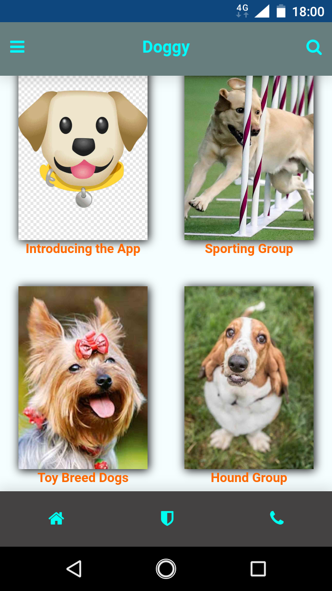

# 🐶 Doggy App  
*A Simple, Informative Mobile App for Dog Lovers*

**Doggy App** is a simple, informative mobile application for dog lovers to explore and learn about dog breeds around the world.  
This is my first no-code app, created in **2020** using the [Appmaker.lk](https://www.appmaker.lk) platform.

  

---

## 🌟 Overview

Doggy App allows you to discover detailed information about dog breeds, organized into clear categories.  
Whether you are a pet owner, an enthusiast, or simply curious, this app provides a fun and easy way to learn about dogs.

🔗 [**Click here to view the app online**](https://myappmaker.io/Doggy/)

---

## 📲 Features

### 🐾 Breed Categories
- Sporting Group  
- Toy Breed Group  
- Working Group  
- Terrier Breed Group  
- Herding Group  
- Many more breeds from all over the world

### 🔍 Search Function
- Easily search for any dog by name

### 📋 Detailed Descriptions
- Brief information about each breed, including traits and characteristics

### 🖼 Visual Overview
- Tap the screenshots below to preview sample screens of the app interface

### ✅ Install and Explore
- Download the APK to install the app on your Android device and view all breed details offline

---

## 📸 Screenshots

[📂 View All Screenshots](./Screenshots/)

---

## 💡 About This Project

- 🛠 **Platform:** Appmaker.lk  
- 🚀 **Created:** 2020  
- 👨‍💻 **Built Without Code:** This is my first app created fully without writing code  
- 🌍 **Purpose:** To help dog lovers and learners easily access information about different dog breeds in a friendly, accessible format

---

## 🔗 View the App Online

👉 [**View Doggy App**](https://myappmaker.io/Doggy/)

---

## 📥 Installation

1. Download the APK file from the [**Releases**](../../releases) section.  
2. Enable **"Install from Unknown Sources"** on your Android device.  
3. Open the APK file and follow the installation prompts.  
4. Launch the app and start exploring!

---

## ✨ Stay Connected

If you have feedback or suggestions, feel free to open an issue or contact me.  
Thank you for checking out **Doggy App** — enjoy discovering the amazing world of dogs! 🐕✨
